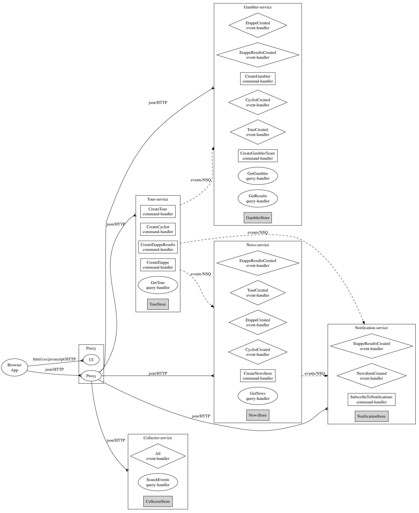

# Microgen

## Goal
Experiment with microservices using go. Truly understand how to balance scalability and understandability.

## Pros of microservice approach
- The core of "micro" is to keep services small so you do not have to understand the full big monolith before you can be effective. 
- Another advantage of this approach that natural boundaries between services make it easy to keep the system modular. 
- Finally, the application that can be chopped into services is easy to scale over multiple machines.

## Cons of microservice approach
- However, in the end you still have to understand the "whole". Clear overview of dependencies between services could help here. 
- Wiring together all the loose components is hard; service registration could help
- Monitoring all the loose components is harder
- Also eventual consistancy introduces new headaches; Cheating in the UI could help
- Guaranteed and tested interworking of all combinations of all versions of all services is very hard: backwards compatible contracts or upgrading as a whole (modular monolith) could help.

## My approach
Specification effort:
* Define your screens 
* Based on screens, determine your commands and queries
* Cohesion and minimizing ripple effect upon change is the primary reason to devide.
* Group related commands and queries in a service if this promotes cohesion. Typically commands and queries related to an specific "aggregate" are grouped together.
* Define your events, that exchange information between services.
* Specify which events a command emits
* Specify on which events a service depends

Develop non-functional components:
* append-only event-store
* publish-subscribe bus
* Scenario based testing: "given-when-then"

Develop functional services:
 * create unit tests
 * implement business-logic: handle commands and events
 * attach service to http and event-bus

Build screens from the provided services:
 * create end-to-end tests
 * develop screens using services

## Functionality
A tour-de-france application:
- Tour: 
    - As event-organiser: Create a tour for a particular year (1)
    - As event-organiser: Add etappes to a tour (2)
    - As event-organiser: Add cyclists to a tour (3)
    - As event-organiser: Publish dayly result of etappes and calculate scores for cyclists and gamblers (4)
    - As event-organiser: Mark cyclist as "abandonnee" (5)
    - As anybody: View tours with their cyclists, etappes and results (6)
- Gambling: 
    - As gambler: Create a profile (21)
    - As gambler: Compose a team of cyclists for a particular year (22)
    - As gambler: View As gambler: scores of my cylists (23)
    - As anybody: View All gamblers with their scores and teams (24)
- News: 
    - As journalist: Create a news item (31)
    - As anybody: View timeline of tour events and news events (32)
    - As anybody: subscribe and receive news via email (33)
- Maintenance: 
    - As system administrator: Keep track of everything that has happens within the system (50)

## Devision of functions in services
### Tour-service
Responsible for managing tours with their etappes and cyclists (1,2,3,4,5,6)

### Gambler-service
Responsible for gamblers and their teams of cyclists and scoring (21,22,23,24)

### News-service
Responsible for accepting news items and providing a timeline of tour and news events (31,32)

### Notification-service
Responsible for sending out tour and news items via email to subscribers (33)

### Collector-service
Non functional service that keeps track of everything that has happened. (5)

### Proxy-service
Responsible for serving the web-UI and hiding all services behind a single http-endpoint. Could be the place to apply your non-functionals (ssl-offloading, security, logging, statistics, etc).

## Concept
An "application" consists of the following concepts:
 - "service": An application consists of one or more loosely couples "services". each service is responsible for keeping is own data.
 - "commands" and "queries"(with "attributes"): Each service supports zero or more commands and queries. Browsers interact with the system via these commands and queries on a services.
 - "event" (with "attributes"): Each command emits zero or more events. An event is used to exchange of information between services in an async away.

##Technical solution
- Use a "dsl" to describe your application in terns of "services", "commands", "queries" and "events". Example: [application.go](./application.go). Based on this system-description some parts of the system are generated. Example: [events.go](./tourApp/events/events.go) and [interface.go](./tourApp/gambler/interface.go). This approach is chosen to achieve consistent approach and ease error phrone tasks.
- Use event sourcing. Store events and rebuild current state by replaying events ralated to an aggregate in the order of arrival. Currently the following aggregate are recognized: Tour and Gambler.
- Could easily use command-Query seperation if scale requires it.
- Provided implementation for "bus" (=to exchange of events between services). Current implementatio is based on NSQ.
- Provided implementation of append-ony "store" for persistence. Current implementation uses the filesystem.
- Provided implementation of http handler to process commands. Current solution is based on gin-gonic.
- Provide a mechanism for starting and configuring services. Current solution compiles into a single executable. This executable can be configured (using command-line flags) to acts a service a, b or c. This to ease the distribution and deployment.
- Declarative way of testing services. Example: [logic_test.go](./tourApp/tour/logic_test.go). Based on this test spec, documentation and relationships between services can be derived. In addition to this, each test scenario (= "given", "when" and "expect") is recorded and written to file. This file describes the scenario exactly in json. Example: [scenario_example.json](./tourApp/doc/example_Create_new_gambler_success.txt)
- Automatically derive clear, exact and up to date documentation that explains how services are related. Example:  [graphviz.dot](./tourApp/doc/graphviz.dot) and 

## Obtaining, building, running and testing

    go get github.com/MarcGrol/microgen
    cd ${GOPATH}/src/github.com/MarcGrol/microgen
    
    # fetch external dependencies: 
    go list -f {{.Deps}}' # to find dependencies of app

    ./sloc_count.sh         # get overview of the application and its compoments
    go test ./...           # to run all unit tests
    go install              # to create executable "${GOPATH}/bin/microgen"
    
    # Sync source-code with application-dsl
    ${GOPATH}/bin/microgen -tool=gen -base-dir=. # to generate interfaces based on ./application.go
    go fmt ./...            # to re-format generated code or
    goimports -w=true .     # requires goimports
    
    # Start the bus
    ./bus/start_nsq.sh
    
    # Start the application
    ${GOPATH}/bin/microgen -service=tour      -port=8081 -base-dir=.
    ${GOPATH}/bin/microgen -service=gambler   -port=8082 -base-dir=.
    ${GOPATH}/bin/microgen -service=news      -port=8083 -base-dir=.
    ${GOPATH}/bin/microgen -service=collector -port=8084 -base-dir=.
    ${GOPATH}/bin/microgen -service=proxy     -port=8080 -base-dir=.
    
    # Fire commands into the application
    curl -X POST --header "Content-type: application/json"  --header "Accept: application/json" --data '{"year":2015}' "http://localhost:8080/api/tour"
    curl -X POST --header "Content-type: application/json"  --header "Accept: application/json" --data '{"year":2015,"id":9,"name":"VAN GARDEREN Tejay","team":"BMC"}}' "http://localhost:8080/api/tour/2015/cyclist"
        curl -X POST --header "Content-type: application/json"  --header "Accept: application/json" --data '{"year":2012,"id":1,"thedate":"2012-06-30T09:00:00+02:00","startLocation":"Liège","finishLocation":"Liège","length":6,"kind":4}' "http://localhost:8080/api/tour/2015/etappe"

    curl -X GET  --header "Accept: application/json"  "http://localhost:8080/api/tour/2015"
    
    # Open UI in browser
    http://localhost:8080/static/index.html
    

